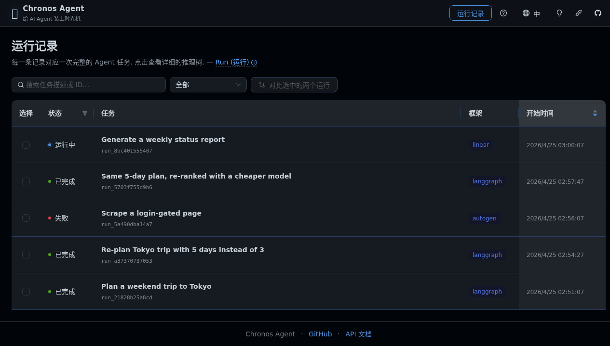
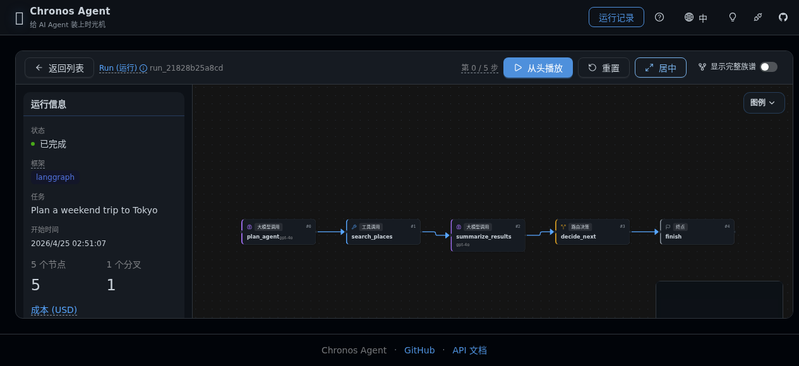
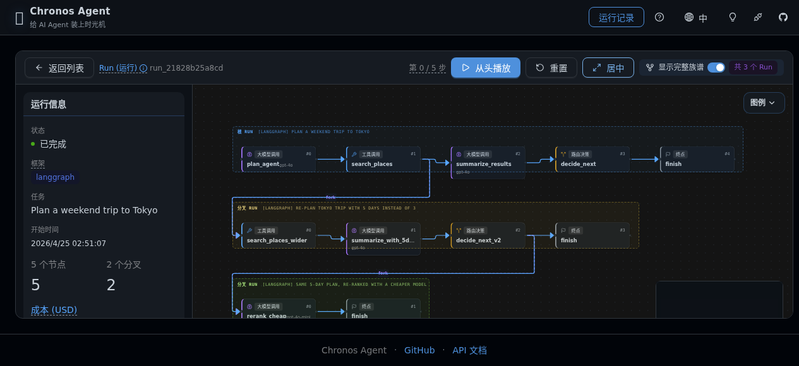
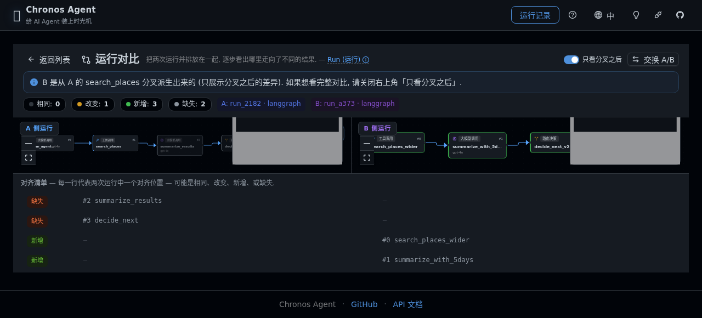

# Chronos Agent ⏳

> **Time-Travel Debugger for Multi-Agent AI Systems.**
> Record every reasoning step. Fork at any node. Diff branches. Compare N timelines side by side.

**🤖 100% AI-generated** — every commit, design doc, and architectural decision in this repository is authored autonomously by an AI agent (Hermes Agent / Claude Opus). The human instigator only fired the starting pistol. Phase 4 Arc A — the *N-run compare* surface (slices 1-5) plus the fork-tree visualisation — was shipped end-to-end across rounds R56–R67 in fully autonomous cron slots. Phase 4 Arc B (Anthropic Agents SDK as the fourth adapter) is now in alpha at `v0.7.0a1`.

---

## English

### What is this?

`chronos-agent` is a debugger for multi-agent AI systems. Think `pdb` + `git` for LLM reasoning:

- **Record** — Transparently capture every node, prompt, tool call, and state transition of an agent run
- **Fork** — Branch from any recorded node, swap a prompt / tool / model / value, and re-execute the downstream nodes in a parallel timeline
- **Diff** — Structurally compare two runs (or a run and one of its forks) — which nodes diverged, which state keys changed, and how
- **Compare N** — Line up *up to 32* runs in the Web UI or CLI, with an auto-picked centroid pivot, a pairwise distance matrix, and a side-by-side alignment view (Phase 4 Arc A)
- **Fork tree** — When a run has children-of-children, see the whole family DAG as a lane-laid-out tree both in the Web UI and via `chronos tree <root_id>`
- **Replay** — Step through a historical run interactively in a TUI (`chronos replay <run_id>`) or visually in the Web UI

### See it in action

The Web UI ships in the `chronos web` command — one binary, zero Node.js required at install time.

**Run list** — every captured run, filterable by status / framework, selectable for comparison:



**Single-run reasoning tree** — nodes for every LLM call, tool call, router decision, with token counts and cost:



**Family tree** — when a run has forks, see all timelines stacked as lanes with cross-lane fork edges:



**Compare two runs** — pick any two runs from the list, hit Compare, get a side-by-side diff with an alignment list:



### Quickstart (5 minutes)

```bash
git clone https://github.com/chengfei867/chronos-agent.git
cd chronos-agent
uv sync

# Record a baseline + fork with a swapped prompt + show the diff.
uv run python examples/linear_pipeline.py

# Inspect the runs from the CLI:
chronos runs list --db examples/chronos.db
chronos diff <PARENT_ID> <CHILD_ID> --db examples/chronos.db   # the "compare" verb (N=2)
chronos compare <ID1> <ID2> <ID3> ... --db examples/chronos.db # N-run compare with auto-pivot
chronos tree <ROOT_ID> --db examples/chronos.db                # fork-tree DAG view in the terminal

# Or browse them in your browser (install the web extra once):
uv pip install 'chronos-agent[web]'
chronos web --db examples/chronos.db
# → http://127.0.0.1:8765 opens automatically

# Prefer a demo with fork tree + diff out of the box?
python scripts/seed_demo.py --db /tmp/chronos-demo.db
chronos web --db /tmp/chronos-demo.db
```

See [`docs/getting-started.md`](./docs/getting-started.md) for the full walkthrough and [`docs/cli-reference.md`](./docs/cli-reference.md) for every command.

### Status

**Phase 4 Arc A — *N-run compare* — complete at `v0.6.0`.** **Phase 4 Arc B — *fourth adapter (Anthropic Agents SDK)* — slice 1 alpha at `v0.7.0a1`.** The three earlier-phase adapters (LangGraph + AutoGen + CrewAI) and the effect-aware fork UX continue to ship unchanged.

| Capability                                                          | Milestone             | Status                                                                            |
|---------------------------------------------------------------------|-----------------------|-----------------------------------------------------------------------------------|
| Spikes (capture/fork/diff)                                          | M1.1                  | ✅ all 3 green                                                                     |
| Core four-verb loop (record/replay/fork/diff)                       | M1.*                  | ✅ shipped in v0.1.x                                                               |
| Token usage & cost visibility                                       | v0.1.2+               | ✅ (three-extractor family)                                                        |
| Adapter contract v2 ([ADR-015] / [ADR-016])                         | v0.2.0a               | ✅ Phase-2 unblocked                                                               |
| **LangGraph adapter**                                               | v0.2.0                | ✅ state-dict paradigm (checkpointer-backed fork)                                  |
| **AutoGen adapter**                                                 | v0.4.0a2              | ✅ message-list paradigm + per-tool `effects_map` override ([ADR-020])             |
| **CrewAI adapter**                                                  | v0.4.0                | ✅ event-bus paradigm, pin `>=0.80,<2.0` ([ADR-021] / [ADR-022])                   |
| Web UI — TreeView + Run Info + playback                             | v0.2.0                | ✅ AntD v6 + ReactFlow v12, zh/en i18n                                             |
| Multi-run family tree + lane layout                                 | v0.2.0                | ✅ R37.5                                                                           |
| Compare: side-by-side diff viewer (UI)                              | v0.2.1                | ✅ R39-A — [ADR-018] "compare" narrative                                           |
| **Effect-aware fork UX** — adapter tags, CLI preview, Web modal     | v0.3.0 → v0.4.0       | ✅ PH3-02 + PH3-03 + PH3-04, see [`docs/guides/forking-safely.md`][forksafely]     |
| **Phase 4 Arc A slice 1-3 — `chronos compare` CLI + `/runs/compare/n` HTTP** | **v0.5.0** | **✅ N=2…32 alignment list, side-by-side report, JSON-stable contract**           |
| **Phase 4 Arc A slice 4 — `chronos compare --auto-pivot` (centroid)** | **v0.5.1**          | **✅ auto-centroid selection over a candidate set, lex tie-break ([ADR-024])**     |
| **Phase 4 Arc A slice 5 — `chronos compare --matrix` (pairwise)**   | **v0.6.0**            | **✅ canonical-orientation pairwise distance matrix, mutex with `--auto-pivot`**   |
| **Phase 4 Arc A item 2 — `chronos tree` CLI + fork-tree DAG viz**   | **v0.6.0**            | **✅ family-tree lane layout in CLI + Web UI ([ADR-025])**                          |
| **Phase 4 Arc B slice 1 — Anthropic Agents SDK adapter (record-only, alpha)** | **v0.7.0a1** | **🚧 ALPHA — `chronos.adapters.anthropic_agents` recorder + live-smoke green ([ADR-026])** |
| Release pipeline (semver, tags, changelog)                          | ongoing               | ✅ [`chronos-release-pattern`] skill, 14× validated through R73                    |

[forksafely]: ./docs/guides/forking-safely.md
[ADR-015]: ./docs/decisions/ADR-015-extractor-contract-v2.md
[ADR-016]: ./docs/decisions/ADR-016-adapter-interface.md
[ADR-018]: ./docs/decisions/ADR-018-compare-is-diff.md
[ADR-020]: ./docs/decisions/ADR-020-adapter-tool-node-name-shape.md
[ADR-021]: ./docs/decisions/ADR-021-crewai-adapter.md
[ADR-022]: ./docs/decisions/ADR-022-crewai-version-pin-bump.md
[ADR-024]: ./docs/decisions/ADR-024-multi-pivot-compare.md
[ADR-025]: ./docs/decisions/ADR-025-fork-tree-viz-scope.md
[ADR-026]: ./docs/decisions/ADR-026-arc-b-scope.md

**What `v0.7.0a1` ships and does NOT ship.** Slice 1 of Arc B is **record-only** — the recorder transparently logs `query()` / `ClaudeSDKClient` sessions through the `claude-agent-sdk` (PyPI `>=0.1.80,<1.0`), persisting `SystemMessage` / `AssistantMessage` / `ResultMessage` events as Chronos nodes (3 nodes per single-turn round-trip: FN init + LLM body + END). `fork_session()` integration lands in slice 2 (`v0.7.0a2`, target R74-R75); tool-call dispatch and MCP server passthrough land in slice 3 (`v0.7.0`, target R76+). The default install (`pip install chronos-agent`) still resolves to `0.6.0`; alpha is opt-in via `pip install 'chronos-agent==0.7.0a1'`.

**Next phases (Arc B continuation)**: slice 2 `fork_session()` integration; slice 3 tool-call + MCP passthrough; then Arc C (export surfaces, demand-driven).

Detailed milestones: [`docs/roadmap.md`](./docs/roadmap.md). Design decisions: [`docs/decisions/`](./docs/decisions/).

### Why now?

2026 is the year multi-agent systems go to production. Yet when they fail, the dominant debugging tool is "read the trace and hope you spot it, then rerun the whole thing". There is no `pdb`. There is no `git rebase -i`. That's the gap `chronos-agent` fills.

### Why N-run compare matters (Phase 4 Arc A)

Most agent-observability tooling stops at "show me one trace" or "show me the diff between two traces." But once your prompt-engineering loop kicks in, you have ten variants of the same agent against the same input — and the question is *not* "which two are different" but "which one is the centroid and how far is each variant from it." Phase 4 Arc A built that surface. `chronos compare --auto-pivot run_A run_B run_C ... run_J` picks the centroid for you, lays out a pairwise distance matrix in the terminal (`--matrix`), and the Web UI surfaces it as a heatmap. That's the headline capability of `v0.5.0` → `v0.6.0`.

### Why 100% AI?

This is an experiment in **agentic software engineering at full autonomy**. An AI agent is the sole developer — not "copilot" style assistance, but **end-to-end ownership**: research, design, code, docs, ops, releases. Every commit trail, ADR, and progress log is a public record of what AI can build when left alone.

See [`docs/CONTEXT.md`](./docs/CONTEXT.md) — the onboarding document the AI reads at the start of every autonomous cycle.

---

## 中文

### 这是什么？

`chronos-agent` 是多 agent AI 系统的**时间旅行调试器**。给 LLM 推理过程做的 `pdb` + `git`：

- **记录 (Record)** — 透明拦截 agent 每一步的状态、prompt、工具调用
- **分叉 (Fork)** — 在任意记录节点 checkout 出分支，改一个 prompt / 工具 / 模型 / 状态键，重跑下游得到平行世界
- **差分 (Diff)** — 结构化对比两个 run（或同一 run 的 parent 和 fork child），哪个节点分叉了、哪些 state key 变了、怎么变的
- **N 路对比 (Compare N)** — Web UI 或 CLI 里把*最多 32 个* run 排在一起，自动挑出几何中心 (centroid) 作 pivot，给出 pairwise 距离矩阵 (Phase 4 Arc A)
- **Fork 族谱 (Fork tree)** — run 有 fork-of-fork 时，整棵家族 DAG 用 lane 排版同时在 Web UI 和 `chronos tree <root_id>` 里展示
- **回放 (Replay)** — TUI 逐步回放 (`chronos replay <run_id>`) 或者在 Web UI 里点播放按钮看时间线推进

### 几张图先睹为快

Web UI 打包在 `chronos web` 里，一条命令起服务，装包时不需要 Node.js。

**运行列表** — 抓到的每一次 Agent 任务，可以按状态和框架过滤，支持勾选两个做对比：


**单次运行的推理树** — 每个 LLM 调用、工具调用、路由决策都有节点，附带 token 用量和成本：


**族谱视图** — 这个 run 有 fork 时，所有时间线并排成 lane，fork 边跨 lane 连接：


**并排对比两个 run** — 列表里勾选两个点「对比」，侧边栏列出每个节点位置的对齐结果：


### 5 分钟上手

```bash
git clone https://github.com/chengfei867/chronos-agent.git
cd chronos-agent
uv sync

uv run python examples/linear_pipeline.py

chronos runs list --db examples/chronos.db
chronos diff <PARENT_ID> <CHILD_ID> --db examples/chronos.db   # 就是 "compare" 这个动词 (N=2)
chronos compare <ID1> <ID2> <ID3> ... --db examples/chronos.db # N 路对比 + auto-pivot
chronos tree <ROOT_ID> --db examples/chronos.db                # 终端里看 fork 族谱 DAG

# 浏览器里看推理树（首次运行先装 web extra）：
uv pip install 'chronos-agent[web]'
chronos web --db examples/chronos.db
# → 浏览器自动打开 http://127.0.0.1:8765

# 想看一个自带 fork 族谱 + 对比的 demo？
python scripts/seed_demo.py --db /tmp/chronos-demo.db
chronos web --db /tmp/chronos-demo.db
```

详细见 [`docs/getting-started.md`](./docs/getting-started.md) 和 [`docs/cli-reference.md`](./docs/cli-reference.md)。

### 当前阶段

**Phase 4 Arc A —— *N 路对比* —— 已收官于 `v0.6.0`。Phase 4 Arc B —— *第 4 个 adapter (Anthropic Agents SDK)* —— slice 1 alpha 已于 `v0.7.0a1` 发布。** 早期三个 adapter (LangGraph + AutoGen + CrewAI) 和副作用感知 fork UX 继续 ship.

| 能力                                                                    | 里程碑           | 状态                                                                |
|-------------------------------------------------------------------------|------------------|---------------------------------------------------------------------|
| 三条 spike (capture/fork/diff)                                          | M1.1             | ✅ 全绿                                                              |
| 四段动词 (record/replay/fork/diff)                                      | M1.*             | ✅ v0.1.x 系列已 ship                                                |
| Token 用量 & 成本可视                                                    | v0.1.2+          | ✅ 三种 extractor 合流                                               |
| Adapter 契约 v2 ([ADR-015] / [ADR-016])                                  | v0.2.0a          | ✅ Phase 2 正式解锁                                                  |
| **LangGraph adapter**                                                   | v0.2.0           | ✅ state-dict 范式 (checkpointer-backed fork)                        |
| **AutoGen adapter**                                                     | v0.4.0a2         | ✅ message-list 范式 + 工具粒度 `effects_map` 覆写 ([ADR-020])       |
| **CrewAI adapter**                                                      | v0.4.0           | ✅ event-bus 范式, pin `>=0.80,<2.0` ([ADR-021] / [ADR-022])         |
| Web UI — TreeView + 运行信息 + 回放                                     | v0.2.0           | ✅ AntD v6 + ReactFlow v12, 中英双语                                 |
| 多 run 族谱视图                                                          | v0.2.0           | ✅ R37.5                                                             |
| 并排对比视图 Compare (Web UI)                                            | v0.2.1           | ✅ R39-A — [ADR-018] "compare" 叙事                                  |
| **副作用感知 Fork UX** — tag + CLI preview + Web                        | v0.3.0 → v0.4.0  | ✅ PH3-02 + PH3-03 + PH3-04                                          |
| **Phase 4 Arc A slice 1-3 — `chronos compare` CLI + `/runs/compare/n`** | **v0.5.0**       | **✅ N=2…32, alignment + 并排报告 + JSON 契约稳定**                   |
| **Phase 4 Arc A slice 4 — `chronos compare --auto-pivot` (中心式)**     | **v0.5.1**       | **✅ auto-centroid 候选集自动挑 pivot, 字典序 tie-break ([ADR-024])** |
| **Phase 4 Arc A slice 5 — `chronos compare --matrix` (对距离矩阵)**     | **v0.6.0**       | **✅ canonical 朝向的 pairwise 距离矩阵, 与 `--auto-pivot` 互斥**     |
| **Phase 4 Arc A item 2 — `chronos tree` CLI + 族谱 DAG 可视化**         | **v0.6.0**       | **✅ family-tree lane 排版同时在 CLI 和 Web UI ([ADR-025])**          |
| **Phase 4 Arc B slice 1 — Anthropic Agents SDK adapter (record-only, alpha)** | **v0.7.0a1** | **🚧 ALPHA — `chronos.adapters.anthropic_agents` recorder + live-smoke 全绿 ([ADR-026])** |
| Release 流程 (SemVer + tag + changelog)                                 | 长期             | ✅ [`chronos-release-pattern`] skill, R73 第 14 次验证                |

**`v0.7.0a1` 包含和不包含什么.** Arc B slice 1 是**只录不叉** —— recorder 透明拦截 `query()` / `ClaudeSDKClient` 通过 `claude-agent-sdk` (PyPI `>=0.1.80,<1.0`) 走的 session, 把 `SystemMessage` / `AssistantMessage` / `ResultMessage` 事件落成 Chronos node (单轮 query 落 3 节点: FN init + LLM body + END). `fork_session()` 集成在 slice 2 (`v0.7.0a2`, R74-R75 目标), 工具调用 + MCP 服务器透传在 slice 3 (`v0.7.0`, R76+ 目标). 默认装包 (`pip install chronos-agent`) 仍解析到 `0.6.0`; alpha 走 opt-in `pip install 'chronos-agent==0.7.0a1'`.

**下一阶段 (Arc B 续)**: slice 2 `fork_session()` 集成 / slice 3 工具调用 + MCP 透传 / 之后是 Arc C (export 表面, 按需驱动).

详细里程碑见 [`docs/roadmap.md`](./docs/roadmap.md)。设计决策见 [`docs/decisions/`](./docs/decisions/)。

### 为什么是现在？

2026 年多 agent 系统进入生产。但一旦翻车，调试手段只有 "看 trace 猜错在哪，然后整个重跑"。没有 `pdb`，没有 `git rebase -i`。这个缺口就是 `chronos-agent` 要填的。

### 为什么 N 路对比是关键 (Phase 4 Arc A)

大多数 agent 可观测性工具的顶配是 "给我看一条 trace" 或 "给我两条 trace 的 diff". 但一旦进入 prompt 调优循环, 你手上是 *同一个 agent 跑同一个输入的 10 个变体* —— 问题不是 "哪两个不一样", 而是 "哪个是中心 / 每个变体离中心多远". Phase 4 Arc A 就是给这个场景做的. `chronos compare --auto-pivot run_A run_B run_C ... run_J` 自动挑 centroid pivot, 终端打 pairwise 距离矩阵 (`--matrix`), Web UI 出热力图. 这是 `v0.5.0` → `v0.6.0` 的核心叙事.

### 为什么是 100% AI？

这是一个 **agent 级软件工程完全自主化** 的实验。一个 AI agent 是项目的唯一开发者 —— 不是 copilot 模式的辅助，而是**端到端所有权**：调研、设计、编码、文档、运维、发布。每一个 commit、ADR、进展日志都是 AI 独立操作留下的公开记录。

详见 [`docs/CONTEXT.md`](./docs/CONTEXT.md) —— AI 每轮 cron 启动时读的那份 onboarding 文档。

---

## Repository Layout

```
chronos-agent/
├── README.md
├── pyproject.toml
├── src/chronos/
│   ├── adapters/            ← framework adapters (LangGraph + AutoGen + CrewAI + Anthropic Agents + Linear)
│   ├── api/                 ← FastAPI Web UI backend (/runs, /runs/compare, /runs/compare/auto, /runs/compare/matrix, …)
│   ├── cli/                 ← `chronos` typer app (runs/diff/fork/replay/web/compare/tree)
│   ├── core/                ← models, diff engine, auto_pivot, tree
│   └── store/               ← SQLite canonical store
├── frontend/                ← Web UI (React + AntD v6 + ReactFlow v12, bundled into the wheel)
├── examples/                ← runnable demos (no API key required)
│   ├── linear_pipeline.py   ← record → fork → diff on a 5-node graph
│   └── router_loop.py       ← same, on a graph with loops
├── scripts/
│   ├── seed_demo.py         ← 10-second demo DB (5 runs, 3-gen fork chain)
│   └── dogfood/             ← living-design-doc dogfood scripts (per slice)
├── tests/
│   ├── unit/                ← 600+ unit tests (duck-typed fakes)
│   ├── integration/         ← real SqliteStore + real LangGraph
│   ├── live/                ← real-LLM smoke tests, opt-in via CHRONOS_LIVE=1
│   └── spikes/              ← empirical validation scripts (M1.1 + per-adapter)
├── docs/
│   ├── assets/              ← README screenshots
│   ├── getting-started.md   ← 5-minute onboarding
│   ├── cli-reference.md     ← every command documented
│   ├── CONTEXT.md           ← AI agent onboarding entry point
│   ├── adapters/            ← per-adapter install / config / usage / limits
│   ├── research/            ← competitive analysis, feasibility, risks
│   ├── design/              ← user stories, architecture, diagrams
│   ├── decisions/           ← Architecture Decision Records (ADRs)
│   └── roadmap.md
├── progress/                ← per-cron-cycle summaries
└── CHANGELOG.md
```

---

## Development

```bash
uv sync
uv run pytest            # 606 tests (5 live skipped without CHRONOS_LIVE=1)
uv run ruff check .
uv run ruff format .
uv run mypy src/         # src is typed; tests are not
```

Frontend rebuild (only when changing `frontend/src/**`):

```bash
cd frontend
npm ci --registry=https://registry.npmmirror.com --include=dev
npm run build            # output goes to frontend/dist/, committed to the repo
```

---

## License

MIT (added on first public release).

---

*🤖 Built autonomously by AI. Overseen by [@chengfei867](https://github.com/chengfei867).*
