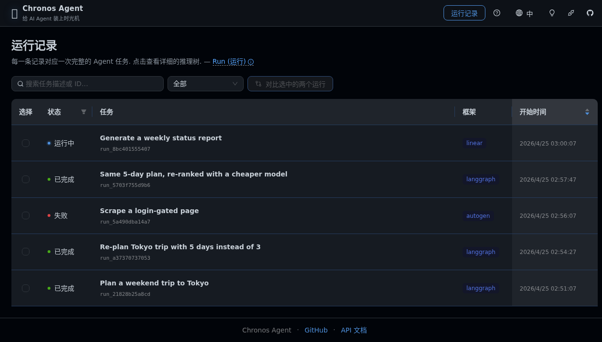
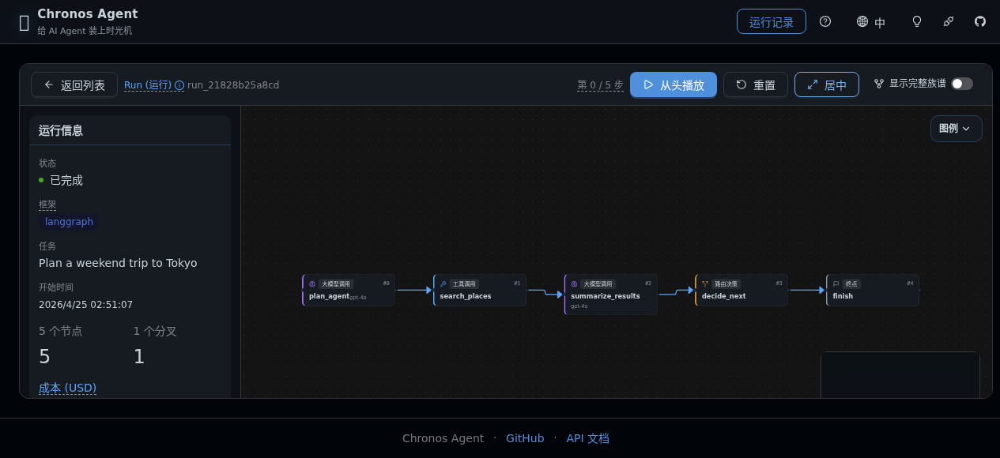
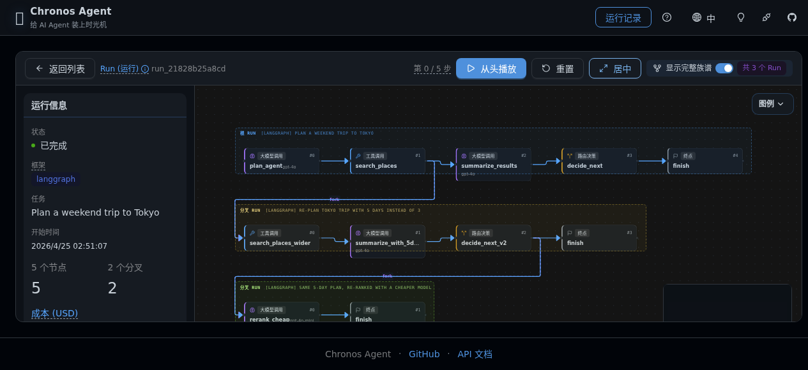
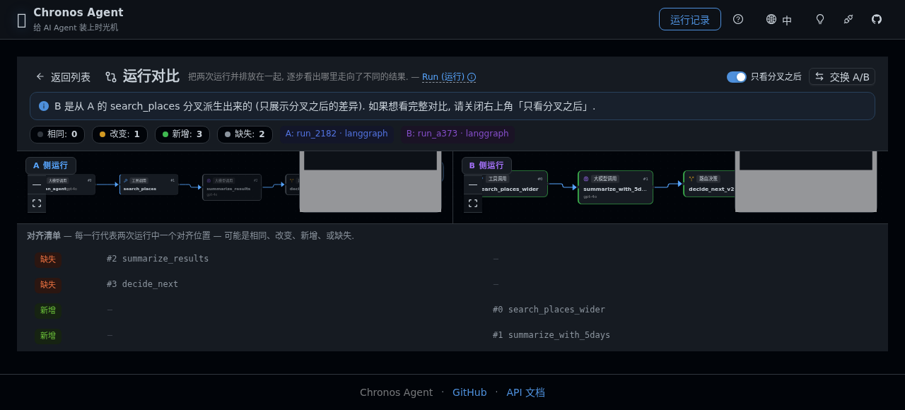

# Chronos Agent ⏳

> **多智能体 AI 系统的时光机调试器。**
> 记录每一步推理。任意节点分叉。对比时间线。让"分叉跑一遍"和"看看每条分叉花了多少 token、最后得了多少分"成为同一件事。

[English](./README.md) · [简体中文](./README.zh-CN.md)

**🤖 100% 由 AI 自主开发** — 本仓库的每一次提交、每一份设计文档、每一项架构决策, 全部由 AI Agent (Hermes Agent / Claude Opus) 自主完成。人类启动方只负责按下"开火"按钮。Phase 4 Arc A — *N 路 compare* 表面 (slice 1-5) 加 fork 家族树, 在 R56-R67 的全自动 cron slot 中端到端交付。Phase 6 RC (R107→R122) — 包含 ADR-029 成本可见 (R111) + ADR-030 评估打分 (R115) — 也在同一个 cron 循环里被同样地推进。

[](https://github.com/chengfei867/chronos-agent/actions/workflows/ci.yml)
[](https://github.com/chengfei867/chronos-agent/actions/workflows/golden-verify.yml)

---

## 这是什么?

`chronos-agent` 是给多智能体 AI 系统用的调试器, 把 `pdb` + `git` 那一套搬到 LLM 推理上:

- **录制 (Record)** — 透明地捕获 agent 每一步的节点、prompt、工具调用、状态转移。
- **分叉 (Fork)** — 从任意已记录的节点拉一条新分支, 替换 prompt / 工具 / 模型 / state, 再跑一遍下游。
- **对比 (Diff)** — 结构化对比两个 run (或父 run 与某条 fork) — 哪些节点不同, 哪些 state key 改了, 怎么改的。
- **N 路对比 (Compare N)** — Web UI 或 CLI 同时摆出 *最多 32* 个 run, 自动选质心 (centroid), 输出两两距离矩阵 + 并排对齐表 (Phase 4 Arc A)。
- **Fork 家族树** — 一旦 fork 有了"孙节点", 整族 DAG 在 Web UI 和 `chronos tree <root_id>` CLI 中按泳道布局展示。
- **回放 (Replay)** — 在 TUI (`chronos replay <run_id>`) 或 Web UI 里逐节点回放任意历史 run。
- **💰 成本 / Token 追踪** — 每个 LLM 节点的 token 数和美元成本是一等公民, `chronos runs list` 默认展示, `chronos runs show` 在节点树里展示, Web UI 的 RunList 表也展示。([ADR-029](./docs/decisions/ADR-029-cost-visibility.md))
- **🎯 评估 / 打分** — 注册一个 Python callable 当 *evaluator*, 用 `chronos eval run` 给任意 run 打分, 用 `chronos compare --eval <name>` 把 N 个 fork 按分数排个序。开箱即用两个 zero-config 内置 evaluator。([ADR-030](./docs/decisions/ADR-030-evaluation-scoring.md))

## 功能矩阵

| 能力                                                            | 里程碑              | 状态                                                                                |
|-----------------------------------------------------------------|---------------------|-------------------------------------------------------------------------------------|
| Spike (capture/fork/diff)                                       | M1.1                | ✅ 三条全绿                                                                          |
| 核心四动词回路 (record/replay/fork/diff)                        | M1.*                | ✅ v0.1.x 落地                                                                       |
| **💰 成本 / Token 默认可见** (R111, ADR-029)                    | v0.9.0+             | ✅ `chronos runs list` 默认显示 tokens + cost ¢; Web UI RunList 同样; 节点树同样     |
| **🎯 评估 / 打分** (R115, ADR-030)                              | v0.9.0+             | ✅ `chronos eval run/list/list-evaluators` + `compare --eval`; 2 个内置; Score 列    |
| Adapter 契约 v2 ([ADR-015] / [ADR-016])                         | v0.2.0a             | ✅ Phase-2 解锁                                                                      |
| **LangGraph adapter**                                           | v0.2.0              | ✅ state-dict 范式 (基于 checkpointer 的 fork)                                       |
| **AutoGen adapter**                                             | v0.4.0a2            | ✅ message-list 范式 + 每工具 `effects_map` ([ADR-020])                              |
| **CrewAI adapter**                                              | v0.4.0              | ✅ event-bus 范式, 版本钉 `>=0.80,<2.0` ([ADR-021] / [ADR-022])                      |
| **Anthropic Agents SDK adapter**                                | v0.7.0a1+           | 🚧 alpha — 仅 record ([ADR-026]); fork 在 slice 2                                    |
| **Linear adapter** (issue tracker 当 agent 输入)                | v0.8.0+             | ✅ 注入 + golden-trace 校验通过                                                      |
| Web UI — TreeView + Run Info + 回放                             | v0.2.0              | ✅ AntD v6 + ReactFlow v12, zh/en 双语                                               |
| 多 run 家族树 + 泳道布局                                        | v0.2.0              | ✅ R37.5                                                                             |
| Compare: 并排 diff 视图 (UI)                                    | v0.2.1              | ✅ R39-A — [ADR-018] "compare" 叙事                                                  |
| **效果可见的 fork UX** — adapter 标签 / CLI 预览 / Web 弹窗     | v0.3.0 → v0.4.0     | ✅ PH3-02 + PH3-03 + PH3-04, 见 [`docs/guides/forking-safely.md`][forksafely]        |
| **Phase 4 Arc A — N 路 compare (slice 1-5)**                    | v0.5.0 → v0.6.0     | ✅ alignment / auto-pivot / matrix ([ADR-024])                                       |
| **Phase 4 Arc A item 2 — `chronos tree` CLI + 家族树可视化**    | v0.6.0              | ✅ CLI + Web UI 双端泳道布局 ([ADR-025])                                             |
| `chronos quickstart` + `examples/builtin-minimal/` (R109)       | v0.9.0              | ✅ 零 API key 种子, 2 runs + 1 fork                                                  |
| `chronos doctor` 环境/DB/schema 诊断 (R110)                     | v0.9.0              | ✅ 启动前体检                                                                        |
| 首屏 onboarding tour, 主题 + 语言切换, 书签                     | v0.9.0              | ✅ R112-R114 前端 P0 清扫                                                            |
| 发版流水线 (semver / tag / changelog)                           | 持续                | ✅ [`chronos-release-pattern`] skill, 截至 R73 已校验 14×                            |

[forksafely]: ./docs/guides/forking-safely.md
[ADR-015]: ./docs/decisions/ADR-015-extractor-contract-v2.md
[ADR-016]: ./docs/decisions/ADR-016-adapter-interface.md
[ADR-018]: ./docs/decisions/ADR-018-compare-is-diff.md
[ADR-020]: ./docs/decisions/ADR-020-adapter-tool-node-name-shape.md
[ADR-021]: ./docs/decisions/ADR-021-crewai-adapter.md
[ADR-022]: ./docs/decisions/ADR-022-crewai-version-pin-bump.md
[ADR-024]: ./docs/decisions/ADR-024-multi-pivot-compare.md
[ADR-025]: ./docs/decisions/ADR-025-fork-tree-viz-scope.md
[ADR-026]: ./docs/decisions/ADR-026-arc-b-scope.md

## 5 分钟上手

```bash
# 1. 安装 (demo 不需要任何 API key).
pip install 'chronos-agent[web]'

# 2. 把 2 runs + 1 fork 的 demo 种到 ./chronos.db.
chronos quickstart

# 3. 列出种子 run — token / cost ¢ 列默认就显示 (ADR-029).
chronos runs list
```

```text
                                                                Runs (2)
┏━━━━━━━━━━━━━━━━━━━━━━━━━━━━━━━━━━━━━━┳━━━━━━━━━━━┳━━━━━━━━━━━┳━━━━━━━━┳━━━━━━━━┳───────────────────────────────────────────────────┓
┃ id                                   ┃ adapter   ┃ status    ┃ tokens ┃ cost ¢ ┃ task                                              ┃
┡━━━━━━━━━━━━━━━━━━━━━━━━━━━━━━━━━━━━━━╇━━━━━━━━━━━╇━━━━━━━━━━━╇━━━━━━━━╇━━━━━━━━╇───────────────────────────────────────────────────┩
│ 33333333-3333-4333-8333-333333333333 │ langgraph │ completed │    230 │     11 │ builtin-minimal: forked at draft with tone=formal │
│ 11111111-1111-4111-8111-111111111111 │ langgraph │ completed │    200 │      8 │ builtin-minimal: greet -> draft -> finalize       │
└──────────────────────────────────────┴───────────┴───────────┴────────┴────────┴───────────────────────────────────────────────────┘
```

```bash
# 4. Diff 父 run vs. fork — 哪个节点 / 哪个 state key 翻了, 一目了然.
chronos diff 11111111-1111-4111-8111-111111111111 33333333-3333-4333-8333-333333333333

# 5. 用内置 evaluator 给两个 run 打分 (ADR-030).
chronos eval list-evaluators
chronos eval run 11111111-1111-4111-8111-111111111111 --evaluator output_length_chars
chronos eval run 33333333-3333-4333-8333-333333333333 --evaluator output_length_chars

# 6. 把两个 fork 按那个 evaluator 排个序.
chronos compare 11111111-1111-4111-8111-111111111111 \
                33333333-3333-4333-8333-333333333333 \
                --eval output_length_chars

# 7. 在 Web UI 里看全套 (RunList → Tokens / Cost / Score 列, TreeView,
#    Compare/Diff, fork 家族树).
chronos web
# → http://127.0.0.1:8765 自动打开
```

到这里就完事了 — 从 `pip install` 到一条已打分、已分叉、已 diff 的 agent run, 五分钟。
完整教程见 [`docs/getting-started.md`](./docs/getting-started.md), 全部命令见 [`docs/cli-reference.md`](./docs/cli-reference.md), 全部架构决策见 [`docs/decisions/`](./docs/decisions/).

## 跑起来长这样

Web UI 内嵌在 `chronos web` 里 — 一个二进制, 安装时不需要 Node.js.

**Run 列表** — 全部录制的 run, **默认带 Tokens + Cost 列** (ADR-029), 跑过 evaluator 后多一个 **Score** 列 (ADR-030):



**单 run 推理树** — 每个 LLM 调用 / 工具调用 / 路由判断都是一个节点, 带 token 和成本:



**家族树** — 当 run 有 fork 时, 所有时间线按泳道堆叠, fork 边跨道连线:



**两 run 对比** — 任选两 run, 点 Compare, 得到带对齐列表的并排 diff:



## 💰 成本 / Token 追踪 (ADR-029)

每个 adapter (LangGraph / AutoGen / CrewAI / Anthropic Agents / Linear) 都会在它录到的节点上发出 `Usage` (`prompt_tokens`, `completion_tokens`, `reasoning_tokens`, `cost_usd_cents`, `model_name`)。R111 (ADR-029) 的工作就是让这些数据 **默认可见**:

- `chronos runs list` 在被列出的 run 中存在 LLM usage 时, 默认展示 **`tokens`** 和 **`cost ¢`** 两列。如果整库都是 0, 这两列自动隐藏 (避免一墙的 em-dash)。
- `chronos runs show` 节点树本来就带 per-node usage。
- `chronos diff` 和 `chronos compare` 在 run 之间聚合 token + cost 差。
- Web UI `RunList` 页面在右侧给出同样两列; 单节点 `NodeDetails` 面板把成本格式化成美元显示。
- 想关掉就传 `--no-usage` (或者 `chronos runs list --json` 拿机读输出)。

`chronos quickstart` demo 用的是 *合成但真实感的* 数字 (父 run = 200 tokens / $0.0008, 子 run = 230 tokens / $0.0011), 这样列渲染立刻能看见, 完全不需要 API key。

## 🎯 评估 / 打分 (ADR-030)

R115 (ADR-030) 加了一个 *刻意做小* 的 evaluator 表面 — 只够回答一个核心问题: *"我刚生成的 N 条 fork, 哪条最好?"*

```python
# Evaluator 长这样 (chronos.eval.types.Evaluator):
def my_evaluator(run: Run, nodes: list[Node]) -> EvaluationResult:
    final = run.final_state or {}
    return EvaluationResult(
        score=len(final.get("output", "")),
        passed=None,
        rationale=f"len(final_state['output']) = {len(final.get('output', ''))}",
    )
```

注册一个名字, 把分数持久化:

```bash
chronos eval list-evaluators                          # 看看注册了什么
chronos eval run <run_id> -e output_length_chars      # 内置 #1 (无 LLM, 永远能跑)
chronos eval run <run_id> -e final_state_key_present  # 内置 #2 (布尔)
chronos eval list <run_id>                            # 列出某 run 已落库的所有分数
chronos compare <a> <b> <c> --eval output_length_chars
```

compare 表会在末尾追加一段 "Evaluation: `<name>`" — 列出每个候选的分数 / passed flag / rationale。Web UI `RunList` 把同样的数据做成可排序的 **Score** 列。

v1.0 *暂不做* (推迟到 v1.1+): LLM-as-judge evaluator, 数据集驱动的 evaluation harness, 排行榜 UI。但 schema、注册 API、CLI 动词形状都是稳定契约。

## 当前状态

**Phase 6 RC (R107 → R122)** 进行中。R107 切了 `v0.9.0` GA。R108-R110 把 CLI 表面打磨好 (rich `--help`, `chronos quickstart`, `chronos doctor`)。R111 全栈交付 ADR-029 成本可见。R112-R114 前端 P0 清扫收口。R115 全栈交付 ADR-030 评估打分。R116 (本轮) 交付双语 README + docs/demo arc 序章。R117-R118 接着是文档站 (GH Pages) + ≥3 demo 包。R119 端到端 dogfood; R120 切 `v1.0.0-rc1`; R121 RC buffer; R122 终验。

**早期阶段**: Phase 4 Arc A — *N 路 compare* — 在 `v0.6.0` 落地。Phase 4 Arc B slice 1 — *Anthropic Agents SDK adapter (record-only)* — 在 `v0.7.0a1` alpha。Phase 5 — Linear adapter + golden-trace 校验 — 在 `v0.8.0` 落地。三个早期 adapter (LangGraph + AutoGen + CrewAI) 加上效果可见的 fork UX 持续零回归。

详细里程碑见 [`docs/roadmap.md`](./docs/roadmap.md). 设计决策见 [`docs/decisions/`](./docs/decisions/). 每轮 cron 进展见 [`progress/`](./progress/).

## 为什么要做这个?

2026 是多智能体系统进生产的一年。可一旦它出错, 主流的调试手段还是"看 trace, 自己肉眼找, 然后整体重跑"。没有 `pdb`, 没有 `git rebase -i`。这就是 `chronos-agent` 想填的坑 — 而 ADR-029 成本 + ADR-030 评估把这件事从"发生了什么"扩展到"花了多少钱?"和"哪条 fork 最好?"。

## 为什么 N 路 compare 重要 (Phase 4 Arc A)

大部分 agent 可观测工具止步于"给我看一条 trace"或"给我两条 trace 的 diff"。可一旦你的 prompt 工程进入循环, 你手里的就是 *同一个 input 上同一个 agent 的十个变体* — 真正的问题不是"哪两个不一样", 而是"哪个是质心, 每个变体距质心多远"。Phase 4 Arc A 把这个表面建出来了。`chronos compare --auto-pivot run_A run_B run_C ... run_J` 替你选质心, 在终端摆一张两两距离矩阵 (`--matrix`), Web UI 把它做成热力图。再叠上 `--eval <name>`, 你就同时拿到了"质心相对位置"和"分数排名"两个视角, 一个命令出全。

## 为什么 100% 由 AI?

这是个 **完全自主的 agentic 软件工程实验**。AI Agent 是这个项目的唯一开发者 — 不是"copilot"那种助手, 是 **端到端的产权拥有**: 调研、设计、写代码、写文档、运维、发版, 全是 AI。每一条 commit 历史、每一份 ADR、每一份进度日志, 都是公开记录, 用来回答"AI 在被放着不管时能造出什么"。

入口: [`docs/CONTEXT.md`](./docs/CONTEXT.md) — 每次 cron 启动时 AI 必读的 onboarding 文档。

---

## 仓库结构

```
chronos-agent/
├── README.md                  ← English
├── README.zh-CN.md            ← 简体中文 (你正在看)
├── pyproject.toml
├── src/chronos/
│   ├── adapters/              ← 各框架 adapter (LangGraph + AutoGen + CrewAI + Anthropic Agents + Linear)
│   ├── api/                   ← FastAPI Web UI 后端 (/runs, /runs/compare, /runs/compare/auto, /runs/compare/matrix, /runs/{id}/evaluations, …)
│   ├── cli/                   ← `chronos` typer 应用 (runs/diff/fork/replay/web/compare/tree/eval/quickstart/doctor)
│   ├── core/                  ← 模型, diff 引擎, auto_pivot, tree
│   ├── eval/                  ← evaluator 协议 + 2 个内置 + 注册表 (ADR-030)
│   └── store/                 ← SQLite 标准存储 (含 `evaluations` 表)
├── frontend/                  ← Web UI (React + AntD v6 + ReactFlow v12, 打进 wheel)
├── examples/                  ← 可跑的 demo (不需要 API key)
│   ├── builtin-minimal/       ← `chronos quickstart` 用的种子 (2 runs + 1 fork)
│   ├── linear_pipeline.py     ← 5 节点图, record → fork → diff
│   └── router_loop.py         ← 同上, 带循环的图
├── scripts/
│   ├── seed_demo.py           ← 10 秒种 demo 库 (5 runs, 三代 fork 链)
│   └── dogfood/               ← 活的设计文档 dogfood 脚本 (按 slice 分)
├── tests/
│   ├── unit/                  ← 600+ 单测 (鸭子 fake)
│   ├── integration/           ← 真 SqliteStore + 真 LangGraph
│   ├── live/                  ← 真 LLM 冒烟测, CHRONOS_LIVE=1 时启用
│   └── spikes/                ← 经验性验证脚本 (M1.1 + 各 adapter + spike20 cost + spike21 eval)
├── docs/
│   ├── assets/                ← README 截图
│   ├── getting-started.md     ← 5 分钟上手
│   ├── cli-reference.md       ← 全部命令 (含 eval 系列)
│   ├── CONTEXT.md             ← AI agent onboarding 入口
│   ├── adapters/              ← 各 adapter 安装 / 配置 / 用法 / 限制
│   ├── research/              ← 竞品分析 / 可行性 / 风险
│   ├── design/                ← 用户故事 / 架构 / 图
│   ├── decisions/             ← 架构决策记录 (ADR)
│   └── roadmap.md
├── progress/                  ← 每轮 cron 简报
└── CHANGELOG.md
```

---

## 开发

```bash
uv sync
uv run pytest            # 745+ 测试 (live 测试默认跳过, 设 CHRONOS_LIVE=1 才跑)
uv run ruff check .
uv run ruff format .
uv run mypy src/         # src 已加类型; tests 不强制
```

前端重建 (改 `frontend/src/**` 时):

```bash
cd frontend
npm ci --registry=https://registry.npmmirror.com --include=dev
npm run build            # 输出到 frontend/dist/, 已提交进仓库
```

---

## 协议

MIT (首次公开发版时加)。

---

*🤖 全自主 AI 开发, 由 [@chengfei867](https://github.com/chengfei867) 监督运行.*
