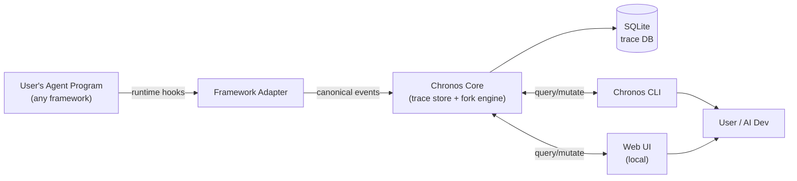
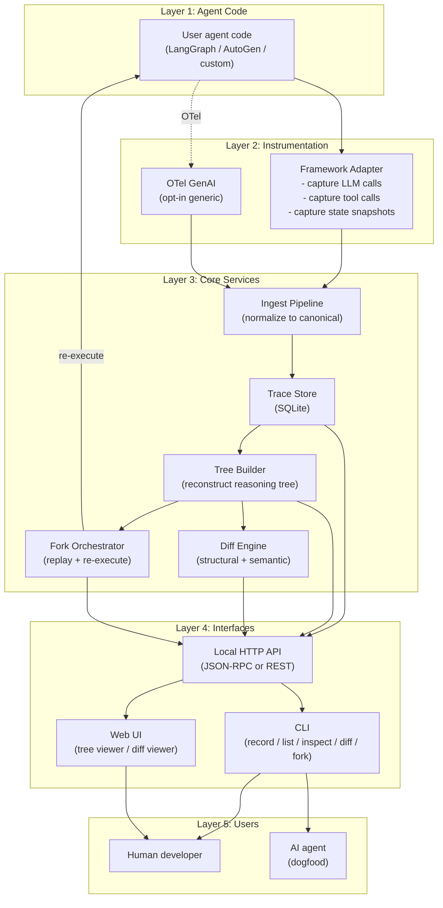
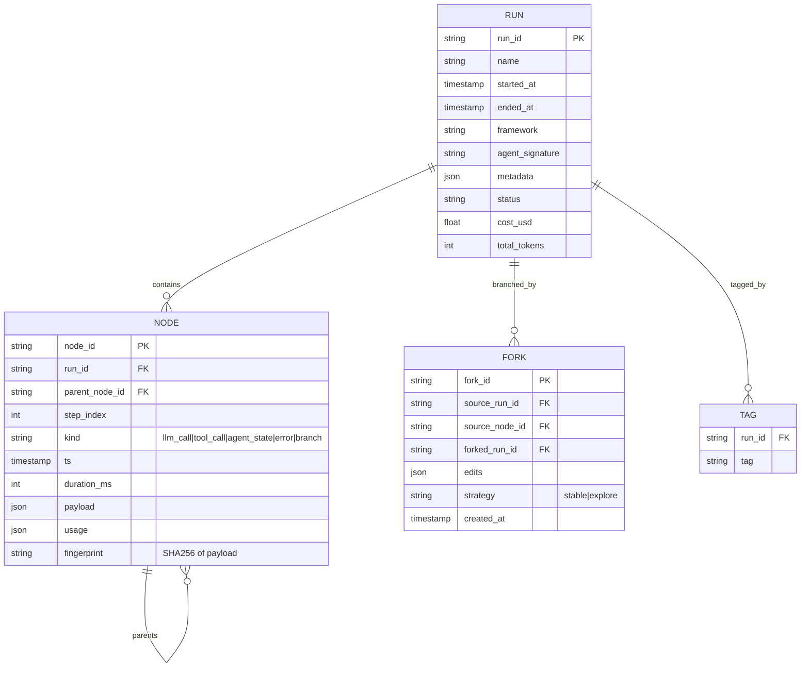
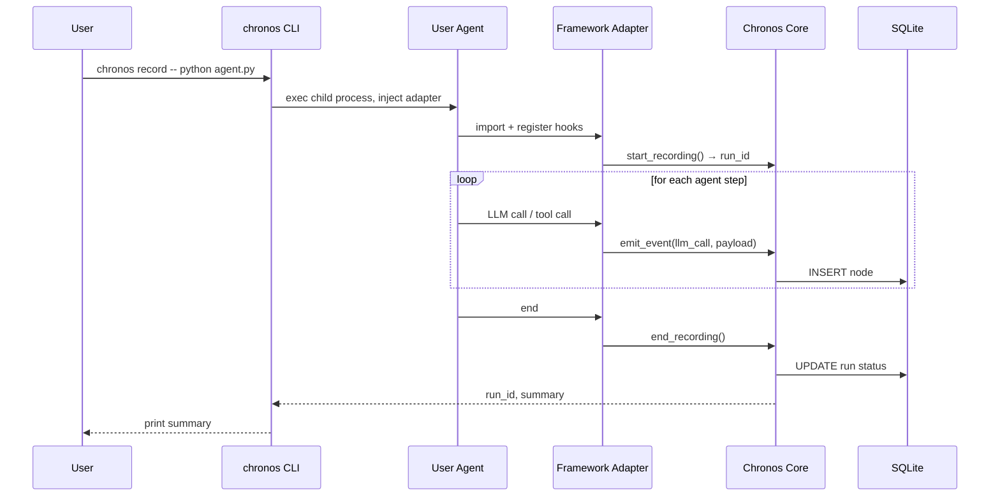
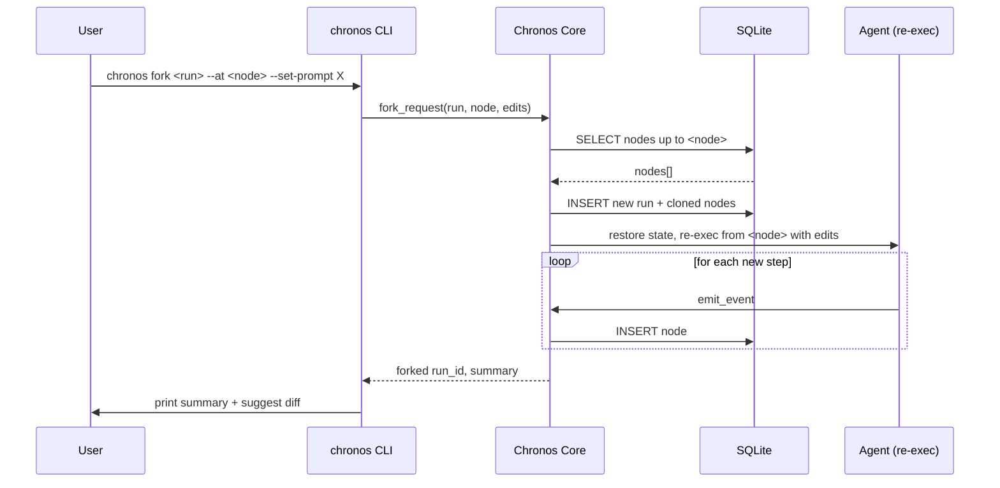
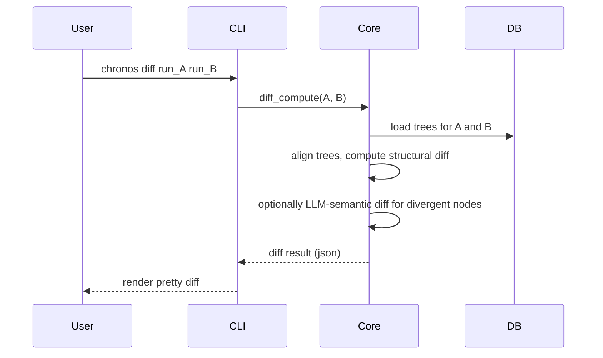

# Architecture Design

**Last updated**: 2026-04-22 (Round 1)
**Status**: Initial architecture — subject to revision after Phase 1 PoC

---

## Design Philosophy

1. **Local-first** — everything runs on the user's machine; no required cloud
2. **Framework-agnostic core** — adapters isolate framework specifics
3. **Schema-first** — canonical event format is the contract
4. **Standards-compatible** — build on OpenTelemetry GenAI semconv and MCP
5. **Progressive disclosure** — CLI before Web UI; SQLite before distributed storage; one framework before many

---

## System Overview (Level-0)



---

## Layered Architecture (Level-1)



---

## Data Model (Canonical)

### Core entities



### Node `kind` variants

| `kind` | `payload` schema |
|---|---|
| `llm_call` | `{model, system, messages[], tools[], temperature, seed, response_message, finish_reason}` |
| `tool_call` | `{tool_name, args, result, error?}` |
| `agent_state` | `{framework, state_blob (serialized), schema_version}` |
| `error` | `{exception_type, message, traceback}` |
| `branch` | `{condition, chosen, alternatives[]}` (for explicit agent decisions) |

### Reasoning tree reconstruction

Given rows in `NODE`:
- Build DAG from `parent_node_id`
- Multi-agent: multiple roots under the same `run_id` = parallel actors
- Sub-tree = sub-agent call

---

## Component Deep Dives

### C1. Framework Adapter (per-framework)

**Responsibilities**:
- Subscribe to framework events (callbacks / middleware)
- Capture LLM call I/O, tool call I/O, agent state checkpoints
- Emit canonical events to Core Ingest

**Interface** (per adapter, language-agnostic):
```
start_recording(run_name, metadata) → run_id
emit_event(run_id, event: CanonicalEvent)
end_recording(run_id, status)
```

**Spot the variation per framework**:

| Framework | Hook mechanism | State capture API |
|---|---|---|
| LangGraph | `with_config(callbacks=[ChronosCallback()])` | `graph.get_state(config)` via checkpointer |
| AutoGen | `@agent.event_handler` | custom message_history serialization |
| Generic OTel | OTel GenAI receiver | none (R1+R2+R4 only, no R3) |

### C2. Ingest Pipeline

**Pipeline**:
```
raw_event → validate schema → normalize (tokens, cost) → dedupe by fingerprint → persist to SQLite
```

Fingerprint allows dedup across identical retries and stable references across forks.

### C3. Trace Store (SQLite)

**Schema** (simplified):
```sql
CREATE TABLE runs (
  run_id        TEXT PRIMARY KEY,
  name          TEXT,
  started_at    INTEGER,
  ended_at      INTEGER,
  framework     TEXT,
  status        TEXT,
  cost_usd      REAL,
  total_tokens  INTEGER,
  metadata      JSON
);

CREATE TABLE nodes (
  node_id          TEXT PRIMARY KEY,
  run_id           TEXT REFERENCES runs(run_id),
  parent_node_id   TEXT REFERENCES nodes(node_id),
  step_index       INTEGER,
  kind             TEXT,
  ts               INTEGER,
  duration_ms      INTEGER,
  payload          JSON,
  usage            JSON,
  fingerprint      TEXT
);

CREATE INDEX nodes_run ON nodes(run_id, step_index);
CREATE INDEX nodes_parent ON nodes(parent_node_id);
CREATE INDEX nodes_fingerprint ON nodes(fingerprint);

CREATE TABLE forks (
  fork_id         TEXT PRIMARY KEY,
  source_run_id   TEXT REFERENCES runs(run_id),
  source_node_id  TEXT REFERENCES nodes(node_id),
  forked_run_id   TEXT REFERENCES runs(run_id),
  edits           JSON,
  strategy        TEXT,
  created_at      INTEGER
);

CREATE TABLE tags (
  run_id   TEXT REFERENCES runs(run_id),
  tag      TEXT,
  PRIMARY KEY (run_id, tag)
);
```

### C4. Tree Builder

In-memory reconstruction of reasoning tree from flat rows. Cached per-run with invalidation on mutation.

### C5. Diff Engine

**Two levels of diff**:

1. **Structural**: compare node-by-node using fingerprint equality, position alignment, type match
2. **Semantic**: for text payloads (prompts, responses), use:
   - Text diff (word-level)
   - Optional: LLM-as-judge for intent-level diff ("are these two responses saying the same thing?")

**Alignment algorithm** (when trees diverge in shape):
- Anchor on shared ancestry up to fork point
- After fork, align by step_index within same agent lane
- Unmatched nodes marked as "only in A" / "only in B"

### C6. Fork Orchestrator

**Algorithm**:
```
fork(source_run, source_node, edits, strategy):
  new_run_id = generate_id()
  copy nodes from source_run up to source_node (with new run_id, preserving step_index)
  apply edits to source_node's payload → emit as first new node
  replay_context = restore agent state at source_node's parent
  re-execute agent from source_node using replay_context
    for each step:
      if strategy == 'stable': use seed, pinned model, temp=0
      if strategy == 'explore': use user-default LLM params
    emit new events → Ingest
  mark fork row
  return new_run_id
```

**Side-effect handling** (see feasibility doc R-T for details):
- Default: tools with `side_effect_level >= "effectful"` return cached result from source_run
- Override: `--re-execute-tools=<list>` to force re-execution
- Future: sandboxed re-execution via E2B/Modal

### C7. CLI

Entry point for most interactions. Commands map to API calls over Local HTTP API or direct in-process if running bundled.

### C8. Local HTTP API

Decouples CLI/Web UI from core. JSON-RPC over HTTP:
- `chronos.run.list`
- `chronos.run.get`
- `chronos.run.tree`
- `chronos.diff.compute`
- `chronos.fork.create`
- `chronos.fork.status` (for streaming progress)

Local by default (bind 127.0.0.1:<port>), not exposed externally.

### C9. Web UI

Rendered as local static bundle, talks to API at localhost. Uses ReactFlow / Cytoscape.js for tree rendering. Deferred to v0.2+ — CLI first.

---

## Sequence Diagrams

### S1. Recording a run



### S2. Forking a run



### S3. Diffing two runs



---

## Deployment Topologies

### T1. Local-only (v0.1 default)
Everything runs on one machine. SQLite file in `~/.chronos/`. CLI invokes bundled core.

### T2. Local + LAN sharing (v0.2 nice-to-have)
CLI can bind API to LAN port; teammates can view each other's traces read-only.

### T3. Cloud-hosted (v1.0+ possible future)
Optional trace upload to hosted chronos cloud. Out of scope for Phase 0–3.

---

## Security Model

- Trace DB is **local-only by default**; filesystem permissions protect it
- LLM API keys are **never stored by chronos**; user provides via environment as always
- **Redaction hooks** — users can register regex / function to scrub PII before storage
- Fork re-execution uses user's own API keys
- No network calls from chronos core except to user-configured LLM provider during fork re-execution

---

## Extension Points (designed-for-future)

1. **Custom diff plugins** — users can register domain-specific diff functions (e.g., "for my RAG app, diff retrieved docs by semantic similarity not text")
2. **Custom adapters** — adapter interface is public; any framework can be added
3. **Trace exporters** — Parquet, OTLP, JSON Lines
4. **Pre-fork hooks** — user code runs before fork (to mutate sandbox env, etc.)

---

## Open Architecture Questions

1. [ ] Should the core be a library (embedded in CLI) or a daemon (shared across CLI / Web)?
2. [ ] Should we ship a single binary (Go/Rust build) or a package (Python/TS install)?
3. [ ] How to handle very long-running agents (>1h) — streaming ingest vs. batch?
4. [ ] Web UI framework: Next.js (heavy but popular) vs. Vite+React (light) vs. Svelte?
5. [ ] Should diff UI support 3-way diff (base, A, B) like git mergetool?

---

*Document owner: Hermes Agent. Major architecture changes require an ADR.*
