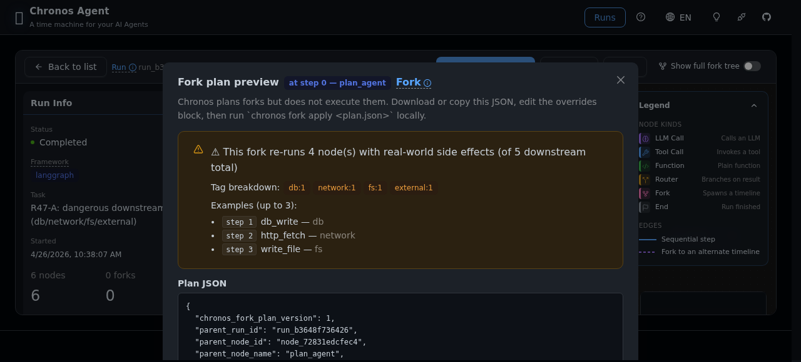
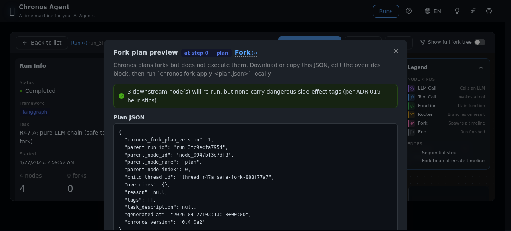
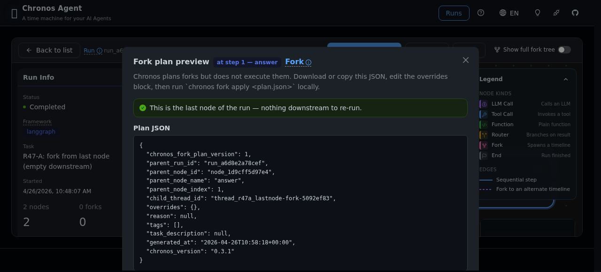

# Forking safely: reading Chronos's effect-aware UX

**Audience:** you opened a recorded run in Chronos and want to fork from
some intermediate node. You want to know whether that fork will re-run
something dangerous (a database write, an HTTP POST, a file deletion)
**before** you hand the plan to `chronos fork apply`.

This guide walks through the three surfaces Chronos gives you for that:

1. The **adapter auto-tagging + node badge + drawer warning** on every node (v0.3.0 / PH3-02).
2. The **`chronos fork plan` CLI preview panel** on your terminal (v0.3.1 / PH3-03).
3. The **Web UI "Fork plan preview" modal** on the tree page (v0.4.0-alpha / PH3-04).

All three read the **same `metadata.effects` tags** on the downstream
nodes. They are three projections of the same truth. Chronos **plans**
forks but never **executes** them — see [ADR-019][adr019] for why.

[adr019]: ../decisions/ADR-019-chronos-does-not-sandbox.md

---

## TL;DR — the decision table

| You see… | Chronos is telling you… | What to do |
|----------|--------------------------|------------|
| 🟢 Alert: *"This is the last node of the run"* | No downstream nodes. Fork is free. | Fork away. |
| 🟢 Alert: *"N downstream node(s), but none carry dangerous side-effect tags"* | Downstream is pure-LLM (or pure-function). Re-running is safe. | Fork away. Cost = N×LLM calls. |
| 🟠 Alert: *"This fork re-runs N node(s) with real-world side effects"* with tags like `db:1 network:2 fs:1` | One or more downstream nodes will re-issue real-world actions if you blindly apply the plan. | **Stop.** Read [`side-effects.md`][sideeffects] and apply one of the three patterns (mock transport / envvar / plan-actuator split) before running `chronos fork apply`. |

[sideeffects]: side-effects.md

---

## Surface 1 — Adapter tag + drawer warning

When you open a run in the Web UI and click any node, the **right-side
Drawer** shows a **Node Details** panel. If that node carries
`metadata.effects` (auto-tagged by the adapter at record time, see
[`side-effects.md` §How Chronos tags][sideeffects-tagging]), you get:

- A red "effects: db, network" badge under the node name.
- A warning Alert:
  *"⚠️ This node touches real-world state (db, network). Forking from
  here will re-run it."*
- A **danger-styled "Fork here" button** at the bottom of the drawer.

Clicking the Fork button opens **Surface 3** (the modal).

[sideeffects-tagging]: side-effects.md#background

### Screenshot — warning drawer

The drawer itself is not captured separately in this guide; it's fully
covered inside Surface 3 below.

---

## Surface 2 — CLI `chronos fork plan`

On your terminal, generate a fork plan. The effects preview is
**rendered by default** alongside the Plan panel:

```bash
$ chronos fork plan <run_id> --at-node-id <node_id> --db dogfood.db
```

You get a **Plan** panel (the JSON artifact you would later feed to
`chronos fork apply`) preceded by a **Downstream side-effects preview**
panel:

```
╭─ Downstream side-effects preview ────────────────────────────╮
│ ⚠ side effects: forking here may re-execute 4 dangerous      │
│   downstream node(s) out of 5 total.                          │
│   breakdown: db=1, external=1, fs=1, network=1               │
│   examples:                                                   │
│     • step 1: db_write (db)                                   │
│     • step 2: http_fetch (network)                            │
│     • step 3: write_file (fs)                                 │
│     • … and 1 more                                            │
│   Chronos does not sandbox fork execution (ADR-019). If these │
│   effects touch the real world, confirm duplicate invocations │
│   are safe before running the fork.                           │
╰───────────────────────────────────────────────────────────────╯
```

The **silence principle** applies: if `dangerous_count == 0` the CLI
**does not show the effects panel at all**. No output = nothing to worry
about.

### Machine-readable output

```bash
$ chronos fork plan <run_id> --at-node-id <node_id> --json
```

prints the raw `ForkPlan` JSON envelope to stdout and **suppresses** the
effects panel (the `--json` flag is stdout-only). For scripted pipelines
that want both the plan **and** the effects summary, call the HTTP
endpoint documented in [§5](#5-http-endpoint) below.

---

## Surface 3 — Web UI Fork plan preview modal

From the tree page, clicking **Fork here** opens a modal (**not** a
drawer — modals are for deliverables, drawers for aux context). Layout:

1. Intro: *"Chronos plans forks but does not execute them. Download or
   copy this JSON, edit the overrides block, then run `chronos fork
   apply <plan.json>` locally."*
2. **Effects summary Alert** (this is the heart of the modal).
3. Plan JSON block (scroll-locked to 320px).
4. Next-steps paragraph with the exact command to run.
5. Footer: **Close · Copy · Download** buttons.

The modal reverses the CLI's silence principle: even when downstream is
safe, it shows a **green success Alert** — because in a modal context
silence looks broken. ("I clicked Fork, nothing happened.")

### 3.1 The dangerous case — orange Alert



What to read:
- **"This fork re-runs 4 node(s) with real-world side effects (of 5
  downstream total)"** — 4 out of 5 downstream nodes carry effect tags.
- **Tag breakdown** — a horizontal row of pills: `db:1  network:1
  fs:1  external:1`. Same counts as the CLI panel.
- **Examples (up to 3)** — first three dangerous nodes by step index.

Action: **do not press Download → apply blindly.** Read the examples,
match them against your adapter code, and decide which of the three
side-effect patterns in [`side-effects.md`][sideeffects] you want to
apply.

### 3.2 The pure-LLM safe case — green Alert



What to read:
- **"3 downstream node(s) will re-run, but none carry dangerous
  side-effect tags (per ADR-019 heuristics)."** — downstream is
  pure-LLM.
- No tag breakdown, no examples — there's nothing dangerous to list.

Action: safe to proceed. Edit the `overrides` block (change a prompt /
model / temperature), save the JSON, and run
`chronos fork apply <plan.json>`.

**Caveat — "heuristics":** effect tags come from adapter-side regex
against node names and tool-call payloads. A function called
`format_report` that internally writes to disk will **not** be tagged.
If your adapter doesn't auto-tag a dangerous tool, pass
`effects_map={"format_report": ["fs"]}` into the recorder. See
[`side-effects.md` §Tagging][sideeffects-tagging].

### 3.3 The last-node safe case — green Alert



What to read:
- **"This is the last node of the run — nothing downstream to re-run."**
- Forking from the last node is purely symbolic — it gives you a plan
  envelope you can edit and replay from, but with zero downstream
  replay cost.

Action: always safe. Useful for "let me re-run just this final step
with a different prompt" workflows.

---

## 4. Download → edit → apply — the three-step dance

Chronos never mutates a fork plan on your behalf. The expected workflow
is:

```bash
# 1. Preview (any of the three surfaces above — this example uses the Web UI)
#    → Download button writes fork-plan-<runId>-step<N>.json locally.

# 2. Edit the overrides block in your editor:
$ $EDITOR fork-plan-run_92f53-step0.json
#    Change prompts, swap the model, tighten temperature, inject a
#    mocked tool definition… whatever hypothesis you want to test.

# 3. Apply the plan — this is where execution actually happens:
$ chronos fork apply fork-plan-run_92f53-step0.json --db chronos.db
```

Step 3 is the **only** step that re-executes anything. Steps 1 and 2
are pure planning and editing. If the effects preview scared you, you
still have a full edit cycle to defuse before any real side effect
happens.

---

## 5. HTTP endpoint — `GET /runs/{run_id}/nodes/{node_id}/fork-plan`

The Web modal calls this endpoint. You can hit it directly:

```bash
$ curl http://127.0.0.1:8765/runs/<run_id>/nodes/<node_id>/fork-plan
{
  "plan": { "chronos_fork_plan_version": 1, ... },
  "effects_summary": {
    "total": 5,
    "dangerous_count": 4,
    "tag_counts": { "db": 1, "network": 1, "fs": 1, "external": 1 },
    "dangerous_samples": [
      [1, "db_write", ["db"]],
      [2, "http_fetch", ["network"]],
      [3, "write_file", ["fs"]]
    ]
  }
}
```

- `plan` is the raw `ForkPlan` envelope (v0.1.1+ contract, stable).
- `effects_summary` is an **advisory** object — the shape is stable but
  not part of the `ForkPlan` schema.

Integration idea: scripted fork campaigns that want the CLI's
`--preview-effects` data without shelling out should call this
endpoint.

---

## 6. Per-tool effect overrides (AutoGen, v0.4.0a2+)

The classifier tags effects by matching keyword patterns against the
adapter-emitted `node_name`. Graph-based adapters (LangGraph) already
produce function-shaped names, so effects Just Work. Message-based
adapters (AutoGen) have to synthesize a name — see
[ADR-020](../decisions/ADR-020-adapter-tool-node-name-shape.md) for
the convention.

For AutoGen, tool event `node_name`s take the shape:

```
{source}:{EventClass}:{tool_name[+tool_name...]}
```

Examples:

- `coder:ToolCallExecutionEvent:fetch_weather_api` → `["network"]`
- `analyst:ToolCallRequestEvent:read_file+query_db` → `["fs", "db"]`

You can override or extend the classifier's verdict per-tool via the
`effects_map` kwarg on the recorder. Keys are exact-match against
`node_name`:

```python
from chronos.adapters.autogen import AutoGenRecorder

recorder = AutoGenRecorder(
    store,
    effects_map={
        # Mark a specific tool as "external" (fire-and-forget API call)
        "coder:ToolCallExecutionEvent:fetch_weather_api": ["external"],
        # Clear tags on a known read-only tool the classifier over-tagged
        "analyst:ToolCallExecutionEvent:list_users": [],
    },
)
```

If you don't supply an `effects_map` entry, the classifier's keyword
regex still runs. The override is only consulted when the key matches
exactly.

**Discovery path**: if your override isn't taking effect, check the
actual `node_name` strings your recorder emitted:

```python
for node in store.get_nodes_for_run(run_id):
    print(f"{node.kind}  {node.node_name}  effects={node.metadata.get('effects')}")
```

Keys in `effects_map` must match those strings character-for-character.

---

## 7. Related reading

- [ADR-019 — Chronos does not sandbox](../decisions/ADR-019-chronos-does-not-sandbox.md)
- [ADR-020 — Adapter tool-event `node_name` shape](../decisions/ADR-020-adapter-tool-node-name-shape.md)
- [`side-effects.md`](side-effects.md) — three patterns for making your
  side-effecting tools fork-safe.
- [ADR-013 — fork auto-execution stays frozen](../decisions/ADR-013-fork-auto-execution-stay-frozen.md)

---

# 安全 Fork 指南：读懂 Chronos 的副作用感知 UX

**面向场景：** 你在 Chronos 里打开了一个已录制的 run, 想从某个中间节点
分叉 (fork), 但在把 plan 交给 `chronos fork apply` **之前**, 你想知道
这个 fork 会不会重跑什么危险的东西 (数据库写入、HTTP POST、文件删除)。

本文覆盖 Chronos 为此提供的三个界面:

1. **Adapter 自动打标签 + 节点角标 + drawer 警告** (v0.3.0 / PH3-02)
2. **`chronos fork plan` CLI 预览面板** (v0.3.1 / PH3-03)
3. **Web UI "Fork plan preview" 模态框** (v0.4.0-alpha / PH3-04)

三者读的是下游节点上**同一份 `metadata.effects` 标签**, 是同一个真相的
三种投影。Chronos **规划** fork, 从不**执行** fork — 见 [ADR-019][adr019].

---

## TL;DR — 决策表

| 你看到… | Chronos 在告诉你… | 怎么办 |
|---------|-------------------|--------|
| 🟢 Alert: *"这是 run 的最后一个节点"* | 没有下游节点, fork 零代价 | 放心 fork |
| 🟢 Alert: *"N 个下游节点, 但都没有危险副作用标签"* | 下游是纯 LLM (或纯函数), 重跑安全 | 放心 fork, 成本 = N×LLM call |
| 🟠 Alert: *"此 fork 将重跑 N 个带真实副作用的节点"* 带 `db:1 network:2 fs:1` 类标签 | 下游有节点会再次触发真实世界动作 | **停.** 读 [`side-effects.md`][sideeffects], 先上三种模式 (mock transport / envvar / plan-actuator 拆分) 之一, 再跑 `chronos fork apply` |

---

## 界面 1 — Adapter 标签 + Drawer 警告

Web UI 里打开 run, 点任意节点 → 右侧 Drawer 展开 Node Details 面板。
如果该节点 `metadata.effects` 非空 (录制时 adapter 自动打的标签):

- 节点名下方一条红色 "effects: db, network" 角标
- 一条 warning Alert:
  *"⚠️ 此节点触碰了真实世界状态 (db, network). 从这里 fork 会重跑它."*
- Drawer 底部一枚 **danger 样式的 "Fork here" 按钮**

点 Fork 按钮 → 打开**界面 3** (模态框).

---

## 界面 2 — CLI `chronos fork plan`

终端 (effects 预览默认打印):

```bash
$ chronos fork plan <run_id> --at-node-id <node_id> --db dogfood.db
```

打印 **Plan** 面板 (fork plan JSON artifact), 紧接着 **Downstream
effects** 面板 (同上英文例子).

**静默原则:** 若 `dangerous_count == 0`, CLI **不打印 effects 面板**.
零输出 = 没啥好担心的.

机器可读输出 `--json`: 只输出 `ForkPlan` envelope 到 stdout,
**抑制** effects preview. 脚本场景若同时想要 plan + effects summary,
走 [§5](#5-http-端点--getrunsrun_idnodesnode_idfork-plan) 的 HTTP 端点.

---

## 界面 3 — Web UI "Fork plan preview" 模态框

Tree 页点 **Fork here** → 弹模态框 (不是 drawer — 模态框装**产出物**,
drawer 装**辅助上下文**). 版式:

1. Intro: *"Chronos plans forks but does not execute them…"*
2. **Effects summary Alert** (核心)
3. Plan JSON 块 (锁定 320px 高度, 可滚动)
4. Next-steps 段, 含精确命令
5. 页脚: **Close · Copy · Download** 三按钮

模态框反转了 CLI 的静默原则: 即使下游安全也**必须显示 green success
Alert** — 模态框里的静默=坏了 ("我按了 Fork 啥反应都没有").

### 3.1 危险场景 — 橙色 Alert


关键读点:
- **"此 fork 将重跑 4 个带真实副作用的节点 (共 5 个下游)"**
- **Tag breakdown** 横排 pill: `db:1  network:1  fs:1  external:1`
- **Examples (最多 3 个)** — 按 step index 取前三个危险节点

动作: **别直接 Download → apply.** 对照你的 adapter 代码,
从 [`side-effects.md`][sideeffects] 三种模式里挑一个再动手.

### 3.2 纯 LLM 安全场景 — 绿色 Alert


关键读点:
- **"3 个下游节点会重跑, 但都没有危险副作用标签 (按 ADR-019 启发式)"**
- 无 tag breakdown, 无 examples

动作: 放心改 `overrides` 块 (prompt / model / temperature), 存盘,
跑 `chronos fork apply <plan.json>`.

**"启发式"警示:** effect 标签来自 adapter 侧对 node name / tool-call
payload 的正则识别。一个叫 `format_report` 的函数如果内部偷偷写盘,
**不会被打标签**。自己的工具要补标签, 在 recorder 上传
`effects_map={"format_report": ["fs"]}`。详见 [`side-effects.md`][sideeffects].

### 3.3 最后节点安全场景 — 绿色 Alert


关键读点: **"这是 run 的最后一个节点 — 没有下游可重跑."**

动作: 永远安全. 适合 "我就想用不同的 prompt 重跑最后一步" 的场景.

---

## 4. Download → edit → apply 三步舞

Chronos 绝不替你改 fork plan, 标准流程:

```bash
# 1. 预览 (三个界面任选, 此处 Web UI 为例)
#    Download 按钮写出 fork-plan-<runId>-step<N>.json
# 2. 编辑 overrides 块:
$ $EDITOR fork-plan-run_92f53-step0.json
# 3. Apply — 这一步才真正执行:
$ chronos fork apply fork-plan-run_92f53-step0.json --db chronos.db
```

只有第 3 步会重跑任何东西. 第 1-2 步纯规划 + 编辑. 即便 preview 吓到
你, 你在触发任何真实副作用前, 还有完整的编辑周期拆弹.

---

## 5. HTTP 端点 — `GET /runs/{run_id}/nodes/{node_id}/fork-plan`

Web 模态框就是调这个端点. 也可以直接打:

```bash
$ curl http://127.0.0.1:8765/runs/<run_id>/nodes/<node_id>/fork-plan
```

返回:
- `plan`: 原生 `ForkPlan` envelope (v0.1.1+ 对外契约, 稳定)
- `effects_summary`: **advisory** 对象, 形状稳定但不属于 `ForkPlan`
  schema

脚本化 fork 活动若想复用 CLI `--preview-effects` 数据而不 shell out,
走这条.

---

## 6. 按工具粒度的 effect 覆写 (AutoGen, v0.4.0a2+)

Classifier 通过关键词模式匹配 adapter 吐出的 `node_name` 来打 effects 标签。
基于图的 adapter (LangGraph) 天然就是函数名形状, 所以 effects 开箱即用。
基于消息的 adapter (AutoGen) 需要自己合成一个 `node_name` — 约定见
[ADR-020](../decisions/ADR-020-adapter-tool-node-name-shape.md)。

AutoGen 的 tool event `node_name` 形状是:

```
{source}:{EventClass}:{tool_name[+tool_name...]}
```

示例:

- `coder:ToolCallExecutionEvent:fetch_weather_api` → `["network"]`
- `analyst:ToolCallRequestEvent:read_file+query_db` → `["fs", "db"]`

通过 recorder 的 `effects_map` 参数可以按工具粒度覆写或扩展 classifier
的判决。key 是对 `node_name` 的精确匹配:

```python
from chronos.adapters.autogen import AutoGenRecorder

recorder = AutoGenRecorder(
    store,
    effects_map={
        # 把特定工具标记为 "external" (fire-and-forget API 调用)
        "coder:ToolCallExecutionEvent:fetch_weather_api": ["external"],
        # 清掉 classifier 误标的只读工具的标签
        "analyst:ToolCallExecutionEvent:list_users": [],
    },
)
```

如果没在 `effects_map` 里提供条目, 关键词正则照跑。覆写只在 key 精确匹配
时才被查询。

**调试方法**: 如果覆写没生效, 检查 recorder 实际吐出的 `node_name`:

```python
for node in store.get_nodes_for_run(run_id):
    print(f"{node.kind}  {node.node_name}  effects={node.metadata.get('effects')}")
```

`effects_map` 的 key 必须一字不差。

---

## 7. 相关阅读

- [ADR-019 — Chronos does not sandbox](../decisions/ADR-019-chronos-does-not-sandbox.md)
- [ADR-020 — Adapter tool-event `node_name` shape](../decisions/ADR-020-adapter-tool-node-name-shape.md)
- [`side-effects.md`](side-effects.md) — 让副作用工具 fork-safe 的三种模式
- [ADR-013 — fork auto-execution stays frozen](../decisions/ADR-013-fork-auto-execution-stay-frozen.md)
